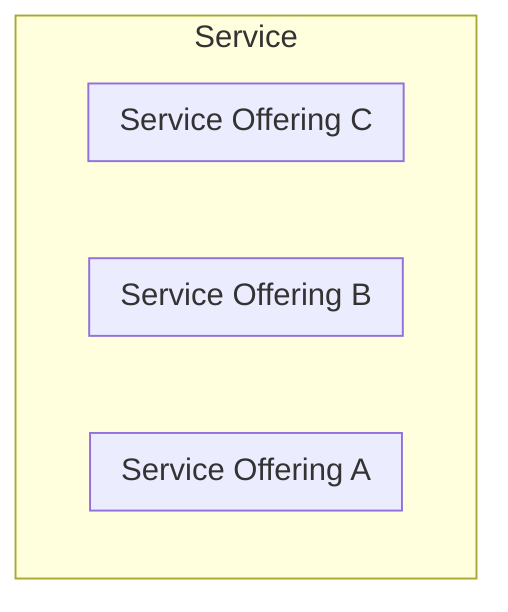

# DRAFT DRAFT DRAFT

# CSDM in Practice
A practical guide implementing ServiceNow CSDM

Version 20240825 

here

# Safe Harbor Statement

This guide provides one approach to implementing the Common Service Data Model (CSDM) on the ServiceNow platform. However, I'm not bold enough to claim that it's the definitive way. The CSDM framework continually evolves through the efforts of engineers at ServiceNow, and if anyone can state the exact way to implement CSDM, it's them. Therefore, your mileage may vary in terms of takeaways from this guide. Your best path forward lies in listening, understanding, and collaborating with others.

# About

As someone working at a moderately large manufacturing multi-conglomerate, I've had the opportunity to collaborate with eight distinct business units (which I refer to as clients). Each client operates independently within the broader context of the business, with its own IT department. My role involves ensuring that all eight clients use the same instance of ServiceNow.

In this guide, I'll share real-world examples of how to implement the Configuration and Service Data Model (CSDM) effectively. Whether you're part of a large organization or a smaller team, these insights can help streamline your processes and enhance collaboration. 

__TL;DR:__ In this guide, I share practical insights on implementing the Configuration and Service Data Model (CSDM) within your organization. Drawing from real-world examples, I discuss how to streamline processes and enhance collaboration across distinct business units. Whether you're part of a large enterprise or a smaller team, these insights can help you effectively use ServiceNow.

# Introduction

One of my favorite post-movie ending scenes comes from the Walt Disney film _Finding Nemo_. In this clip, a band of fish escapes from their aquarium and returns to the ocean, only to discover that they are still trapped in their plastic baggies floating ontop of the water. The scene ends with the poignant question, 'Now what?' The reason why this scene resonates is we have all been there. Whether you're a customer or a partner, we've all been there. After the flashy presentations, dazzling demos, and once the ink has dried on the digital contracts, it's time to actually implement what you've purchased.

Anytime a solution is purchased, the number 1 question on the minds of leadership is "when will the solution be up and running?" Ultimately they want to see return on investment as soon as possible. Now of course the answer varies on many factors like leadership involvement, staff knowledge and utilization of external ServiceNow implementation partners. Now if you are reading this you are either in the position of pre-implementation or post implementation of ServiceNow. The later is a bit more effort to make changes, but it is possible and I will lay out strategies where it makes sense.  

The architects and engineers at ServiceNow have developed an excellent model called the Common Service Data Model (CSDM). This model helps organize and enhance our understanding of the various services offered by our organization and the best place to start from when implementing the ITSM module of ServiceNow. The CSDM does integrate with other various modules of the ServiceNow platform as well, which I am still exploring and implementing.

## Why

Before we begin, it's important to address the "why" question: Why go through the effort of setting up the Common Service Data Model (CSDM) in ServiceNow? The best way to answer this is through my own experience.

Prior to adopting ServiceNow, my employer faced decades of challenges with basic IT practices that negatively impacted customer satisfaction and caused long-term internal friction. One of the most noticeable issues was ticket misrouting, which led to delays of weeks, and sometimes even months, in delivering services. This frustrated customers, who felt that IT was disorganized as their tickets were passed between multiple teams. It was clear that we couldn't carry the "sins of the past" into the future with ServiceNow.

I had an incredible mentor, and upon his retirement, I asked him, "What is the biggest hurdle IT has yet to overcome during your tenure at the organization?" His response was, "The CFO has yet to understand the value IT brings to the organization." As a cost center, IT departments are often seen as only consuming money rather than generating it. In a large and diverse organization, this perception is exacerbated as IT costs continue to rise.

I started with a simple two-part problem statement: "How do we prevent ticket misrouting?" and "How do we demonstrate IT's value?" The CSDM provided all the necessary components and definitions but lacked specific instructions. I filled in the gaps based on personal experience, intuition, and a dedicated team focused on solving these fundamental issues. As a result, our ticket misrouting is now at an all-time low, and we have developed reports that clearly show the value IT brings to the organization.

So, let's roll up our sleeves and get to work.

## Baseline

If you are unfamilar with ServiceNow's CSDM, I recommend you first search for it online and read what the authors’ have to say, before you read what this guide has to offer. I cannot provide a link because the way ServiceNow keeps their documentation evergreen and any link will be outdated without notice. A simple “ServiceNow CSDM” Internet search will suffice. From there, you can get all the formal definitions and explanations directly from the source. No reason for me to copy-paste what is already publicly and freely provided.

## Boiled Down Baseline

The CSDM serves as an organizational framework for business operations. Analogous to personnel org charts that depict connections between individuals, the CSDM provides a model to illustrate relationships within business processes. From the smallest assets—such as a shop floor thermostat—to high-level business operations at the C-suite, the CSDM establishes links across the entire spectrum.

In essence, the CSDM offers a holistic view of an organization's assets, services, and their interdependencies, facilitating efficient management and strategic alignment. If you'd like further details, I recommend referring to authoritative resources (ServiceNow) on the topic.

## Before We Begin

The CSDM is an evolving framework. Currently, the CSDM stands at version 4, with version 5 in draft. The crucial lesson here is to remain adaptable—neither fixated on completion nor frustrated by new versions announced by ServiceNow. This is does not mean scrap and rebuild each time. Rather take the time to better understand that various components that make up the CSDM and then stick with a model that best suits your organization.
   
Individuals rarely approach a project without preconceptions and ideas. Life experiences shape our perspectives and then them to future enhancements. Expect discussions comparing CSDM to other product models. The key lies in active listening to requirements and avoiding emulating other products within the ServiceNow ecosystem. Let ServiceNow maintain its unique identity and move off the other platform.
   
Leadership may underestimate the complexity of CSDM setup. Exercise patience and maintain a calm, matter-of-fact demeanor. Educate them on the process while emphasizing realistic expectations. Normally the expectations are around how long this will take. The mileage will vary from organization to organization, but it is common for this to take years to build out from scratch. They key to where to start.

Remember, successful CSDM implementation involves collaboration, adaptability, and clear communication.

# Services

At the core of every organization are the services it provides, as these services are the primary way organizations meet the needs of their customers and generate revenue. Whether it's a product-based company offering customer support, a consultancy providing expert advice, or a tech firm delivering software solutions, the services offered are essential to the business's value proposition. This concept is central to the CSDM, which emphasizes that every position, regardless of role, provides a service. 

__Sidebar:__ When defining services at your organization, you are going to receive push-back. Remember, everyone that receives a paycheck is being compensated for providing a service to the organization. In the 1999 movie _Office Space_, two consultants—Bob Slydell (played by John C. McGinley) and Bob Porter (played by Paul Wilson)—interview an office worker named Tom Symkowski (played by Richard Riehle). Their goal is to better understand everyone's role within the company to then help with efficiency. The scene is hilariously depicted as the two Bobs try to grasp what Tom actually does. After a back-and-forth banter, Bob Porter finally asks, 'What is it that you actually do here?' Tom then launches into an unhinged tailspin rant. If you haven't seen the movie, consider watching it before continuing with this guide. It is a good representation of whhat is to come.

## Service Types

There are three primary service types in ServiceNow; application, business, and technical. These three form the broader groupings of services you will define and all are extended from the Configuration Item [cmdb_ci] table.

### Technical Services

**Technical Services** defines the "what" is being provided as a service. (Notice, I did not include "how", this is important and will come into play later on.) Technical Services should not be interpreted solely as "technology", but rather as "technically", in the sense of "technically, this is what I know" or "technically, this is what I provide." The focus should be on what teams and individuals know or provide when defining technical service offerings. This is not to say Technical Service definitions cannot be technology, they can be as well. For example Microsoft Active Directory can be defined as a Technical Service as that is a service provided through that solution for identity and access management. 

For instance, if you need to open a ticket requesting assistance with setting up a cubicle for a visiting guest, this is not a technology but a service likely provided by the Human Resources department, an office/floor manager, or a administration assistent. Therefore, you can and should create a technical service called Office Management or Office Resources. It is important not to confuse these with business services, as they are entirely different.

### Application Services

**Application Services** are not related to software applications. (Take a moment to let that sink in.) Remember that the CSDM is an evolving and ever maturing framework introduced by ServiceNow. While the term Application Service may not accurately convey its intended meaning, the underlying definition is correct. When ServiceNow chose the term application, the means was more inline to the academic sense of "to apply." One of the early authors of the CSDM expressed regret over not naming it "System Services," but I believe that would not have been a better choice.

Instead of thinking of Application Services as software applications, consider Application Services as Deployed Services (though I will not use this term officially, it helps illustrate the concept). Application Services represent the deployments (or instances) of a solution within the organization. Another way to view them is as actualizations, meaning what is real in practice.

For example, if you need a temporary cubicle for a visitor and have offices in Burbank, London, and Madrid, you can have three Application Services for each office, representing the organization's presence in these distinct locations. When a ticket is created, the Application Service can help route it to the appropriate assignment group for each location.

The same principle applies to digital solutions. Suppose each of the three office locations has an instance of the timekeeping solution Kronos, and the IT department also maintains development (DEV) and user acceptance testing (UAT) instances of Kronos. In this case, there would be five Application Service definitions in ServiceNow, one for each deployment of Kronos at the office locations (3) and for development and testing (2).

#### Technical Services and Application Services Overlap

Confusion can arise when Technical Services and Application Services overlap. For instance, Microsoft Active Directory can be classified as both. As a Technical Service, it represents the general expertise professionals have about Microsoft Active Directory. In contrast, as an Application Service, it pertains to the deployment of Microsoft Active Directory on domain controllers within the organization.

### Business Services

**Business Services** address the broader question, _“What can the organization accomplish?”_ These services consolidate all Technical and Application Services into groupings that provide comprehensive answers to overarching organizational questions. Essentially, Business Services are designed for understanding at the director level and above. Examples of Business Services include Financial Services, Marketing, Sales, Manufacturing, Legal Services, among others.

While defining Business Services is crucial for understanding the larger landscape of the organization, they are typically the last to be defined and are considered lower in priority. This is because Technical Services and Application Services form the foundational elements that constitute Business Services. Therefore, it is more effective to focus initially on defining Technical and Application Services.

## Service & Service Offerings

There are two distinct definitions for each service type mentioned above: **Service** and **Service Offering**. For detailed definitions, please refer to ServiceNow’s documentation on what constitutes a Service and a Service Offering.

To simplify the formal ServiceNow definitions, a **Service** is a collection of Service Offerings. A **Service Offering** represents the most granular level of service within its Service. While the concept is straightforward, it can be expanded as needed.

__TL;DR:__ services are the buckets and Service Offerings are the marbles in the buckets. 

It can get complicated because technically you chain together Services and Service Offerings as they share a base table with a parent field. On one hand, this offers flexibility to model complex models of services. On the other hand developing, maintaining, supporting, and reporting can become quite tedious very quickly.

My recommendation is to keep it simple with these basic rules. 

- A single Service shall have 1 or more Service Offerings.
- A Service shall not have a parent Service of the same service type.
- A Service could have no parent.
- A Service Offering shall have a Service as a parent.

This keeps a flat set of records where Services are groupings of Service Offerings.

Examples:
- Network (Service)
    - WAN (Service Offering)
    - LAN (ServiceOffering)
    - MPLS (Service Offering)
    - WIFI (Service Offering)
- Identity and Access Management (Service)
    - Active Directory (Service Offering)
    - Active Directory Accounts (Service Offering)
    - Active Directory Groups (Service Offering)
    - LDAP (Service Offering)
    - SSO (Service Offering)
- Field Offices (Service)
    - Burbank (Service Offering)
    - London (Service Offering)
    - Madrid (Service Offering)

There are a couple of reasons we set this up this way.
- __Easy to understand standard__ - A simple relationship between all Services and Service Offerings is straightforward. Once you get into multiple levels the maintenance of the organization of the records can get confusing. ServiceNow allows for a complex tree-structure when it comes to all services, the problem becomes obvious overtime, as roles and organizations change. 
    __TL;DR:__ you are smart, but your predecessor might not be. So keep it simple.
- __Simple lookups__ - There is a balance between easy to search and easy to find. They are two completely different definitions in the context of user experience (UX). On one hand, having the scroll through volumes of records can be very tedious. And then also having to hunt for what you are looking for with multiple mouse-clicks can also be tedious as well. By having a two-tier relationship between Services and Service Offerings you are addressing both the search and find aspect of UX. Searches can easily be narrowed down to two searches; one for the right Service and one for the right Service Offering. Instead of complex tree searches. Finding through the act of mouse-clicks is narrowed down to two mouse-clicks.
    __TL;DR:__ save yourself from headaches later on when developing solutions that rely on the CSDM records.
- __Easier reporting__ - An area that constantly gets overlooked is reporting. You want reports to represent information equally and consistently. By having a two-tier relationship between Services and Service Offerings, reports will be far easier to understand without having to understand embedded sub-services; which in the long run, we have found really does not result in better outcomes or decisions.
    __TL;DR:__ complex CSDM models equals complex reporting.

__Key Point:__ Keep Service and Service Offerings simple. The CMDB is already complex enough, do not make more work for yourself by making the the CSDM complex too.

## Nouns & Verbs

The CSDM defines various types of services as defined above; technical services, technical service offerings, and application services that you will need to setup. When setting up a service definition/record, all services definitions should be nouns with no verbs.

Service definitions can be either generalized nouns or proper nouns with no verbs in their definition. The reason is many times a service can have multiple actions (verbs) and that is better saved for catalog items (requests). 

Here are a few examples of common mistakes.

| Incorrect Service Name | Correct Service Name      |
|------------------------|---------------------------|
| Password Reset         | Active Directory Account  |
| Windows Update         | Microsoft Windows Desktop |
| Provision SAP Account  | SAP Account               |
| Security Remediation   | Attack Surface Management |

__TL;DR:__ service definitions should only contain nouns and catalog items should be the verbs.

__Leadership Alert:__ When setting up Services and Service Offerings, the whole noun concept is a hard concept for leadership to grasp. Leadership would want to create services with verbs in the definition. For example adding “grant”, “revoke“, “reset”, etc. etc. into the service definition name. The problem is using verbs would create an avalanche of service offerings. Because then there is “provision”, “reclaim”, “add”, “delete”, “security remediation”, “patch”, “update”, “upgrade”, and the list continues on and on. Then trying to stay consistent becomes something to manage as well, when do you use “add”, “provision”, or “create”? Ultimately, leadership wants to ensure they can see what actions (verbs) their teams were performing. Explain how catalog items capture the verbs and how they would generate reports based on request items. 

__Real World:__ One of the challenges I ran into was a scenario where a single service offering was supported by 3 different support groups. One support group supported provisioning virtual machines, one support group supported patching virtual machines, and a third support group supported backing up and restoring virtual machines. Leadership wanted the following Service Offering definitions:

- Virtual Machine - Provision
- Virtual Machine - Patching
- Virtual Machine - Backup & Restore

I knew there were more operations (verbs) for virtual machines. I worked on understanding what the teams did and came up with the following Service Offering definitions. I still had to create 3 different service offerings for virtual machines, because a Service Offering can only have 1 support group. But, none of the Service Offerings have verbs in their definitions.

- Virtual Machine - Services
- Virtual Machine - Operations
- Virtual Machine - Disaster Recovery

__Virtual Machine - Services__ would take care of provisioning, reclamation, resizing, and moving of virtual machines. 
__Virtual Machine - Operations__ would take care of updates, upgrades, and security remediation of virtual machines.
__Virtual Machine - Disaster Recovery__ would take care of backups, recovery, and planning. 

## Advice

Here are some tips to consider when setting up service standards in your organization.

### Unique Names 

Typically, unique names are not a problem when defining records. But, what happens when:

- you have multiple teams or sub-teams that provide tiered support?
- you have multiple IT departments within multiple companies within the same organization?
- you have multiple teams in different locales?

Though service records contain various fields, the services cannot cover all the various scenarios that make your company unique. The go to for some is to create custom fields and there are cases where this would be applicable. If you can forsee duplicate service names, consider using additional attributes to differentiate services by their names. 

I prefer a _”pill”_ or _”block”_ approach for naming standards. A _”pill”_ uses parentheses and a _”block”_ uses square brackets to append tags to service names to make them unique. I have not run into a case where I would use both a pill and block style for naming convensions on the same platform; either will suffice in ServiceNow. Within the pill or block the standard of tags can be defined and set apart.  

The standards below are examples based on needing to support 8 different clients on the same instance of ServiceNow. Your mileage will vary based on your organization’s structures. Take this an idea and implement your own version that best fits your organization's style.

##### Scenario
I will be using the following scenario as an example for defining various services.

A hypothetical organization is comprised of 3 companies (COM1, COM2, and COM3) with each having their own IT department. Each of these companies have an Identity and Access Management (IAM) team. All three companies use a multi-service provider (MSP1) to handle all tier 1 service desk calls for IAM requests and incidents. The COM1 company has outsourced tier 2 support to external vendor EXT1. And then all 3 companies provide final support.  

#### Technical Service

The syntax for technical services:
        
`<name> (<company stock symbol>|<department code>)`

where:
- __\<name\>__ is the name of the service
- __\<company stock symbol\>__ is the company stock symbol
- __\<department code\>__ is the department code or symbol

Department code is needed for similar technical service names within a company as many departments have simalar service names. As an example “Security” could be used for both physical security at facilities and cybersecurity for IT. “Engineering” could be used for manufacturing, R&D, and PLM for IT. 

##### Scenario

In this scenario, notice how there are no definitions at the Technical Service level for external suppliers MSP01 and EX01. The reason is rarely are external suppliers accountable at the business level. Even though they provide a service for the organization, they are replaceable. Technical Service[HERE I AM]

| Technical Service                         | Support Group |
|-----------------------------—-------------|---------------|
| Identity and Access Management (ABA\|ITN) | SN_C01_IAM    |
| Identity and Access Management (CAC\|ITN) | SN_C02_IAM    |
| Identity and Access Management (DEL\|ITN) | SN_C03_IAM    |

#### Technical Service Offering 

The syntax for technical service offerings:
        
`<name> (<company stock symbol>|<T#>)`

where:
- __\<name\>__ is the name of the service
- __\<company stock symbol\>__ is the company stock symbol
- __\<T#\>__ is the support tier number

Regarding tier number, tiers are integers that start at 1 and goes to N. When defining services with tiers, make sure the tiers are consecutive with no gaps; gaps add confusion and doubts. Also, as an advanced tip, tier 0 should be reserved for automation. When designing workflows/flows that perform automation, make sure that tickets that have service fields use tier 0 services to denote automation operations.

##### Scenario

| Technical Service Offering                | Support Group |
|------------------------------------------|---------------|
| Active Directory - Accounts (ENT\|T1)    | Zeta          |
| Active Directory - Accounts  (ALP\|T2)   | Delta         |
| Active Directory - Accounts  (ALP\|T3)   | Alpha         |
| Identity and Access Management (BET\|T2) | Beta          |
| Identity and Access Management (GAM\|T2) | Gamma         |

__NOTE__: See section _Support Groups_ regarding proper naming conventions.
